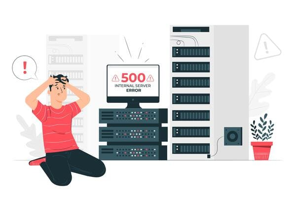
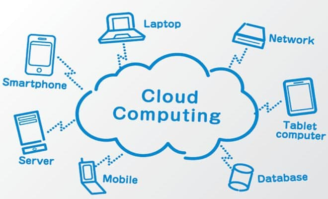

# AWS Cloud Administration

## What we lear :

- Cloud Concept Overview
- Cloud Economic and Billing
- AWS and Global Infrastructure Overbiew
- AWS and Cloud Security

# 1. Cloud Concept Overview

## Topics :

1. Introduction of Cloud Computing
2. Advantages of Cloud Computing
3. Introduction to Amazon Web Service (AWS)

## 1. Introduction of Cloud Computing

Cloud Computing merupakan suatu bentuk pemanfaatan dari Internet dalam melakukan komputasi atau dengan kata lain menggunakan sumber daya IT seperti komputasi, storage, database, aplication, dengan resource lainnya dengan membayar sesuai pemakain (Pay as you go).

Contoh kecil seperti Google Drive dimana kita dapat mengunanakanya untuk menyimpan data kita melalui internet tanpa memikirkan bentuk fisik, atau infrastucuture dibelakangnya. Kita tidak perlu memberi tahu sebelumnya bahwa kita akan membutuhkannya. dimana tiba-tiba kita membutuhkan 300 server virtual atau kita membutuhkan penyimpanan 2000 terabyte, cukup dengan koneksi internet dan mencari penydeia layanan dan beli atua sewa resource yang kita butuhkan. Suatu saat kita tidak membutuhkannya lagi, dengan cepat, kita dapat mengembalikannya dan segera berhenti membayar. Disnilah yang dimaksudkan dengan Pay As You Go, kita membayar seusai yang kita pakai.

Beberapa pertanyaan mungkin apa muncul, seperti perbedaan Cloud Computing dengan Tradisional Data Center (On Premise). Secara garis besar pebedaannya dikenal dengan istilah Infrastructure as a Software.

Pada On Premise kita menggunakan Hardware sebagai Infrastructure namun pada Cloud Computing kita memanfaatkan Software sebagai Infarstucture.

### Hardware Computing Model :

- Infrastrucrure as Hardware
- Hardsware Solution :
  - Membutuhkan ruangan, staff untuk manage hardware, Sucurity, Perencanaan dan Modal Awal
  - Siklus pengadaan hardware yang panjang, seperti mulai dari plan, pembelian, setup, maintenance infrastucture dan lainnya.

Sebagai IT Infra ini akan menjadi tugas utama dalam manage infrastucture-nya, dari segi hardwarenya, kabelnya, storage, network hardware karena infrastructure berbentuk fisik atau hardware.

Untuk posisi pekerjaan pada Hardware Computing Model antara lain : IT Infra, Network Engineer, System Administrator, Storage Administartor.

### Cloud Computing Model :

- Infrastrucrure as Software
- Software Solution :
  - Flexible
  - Dapat melakukan perubahan dengan cepat, mudah, dan hemat biaya dibandingkan hardware

Segala bentuk kegiatan yang bersentuhan langsung dengan hardware pada Hardware Computing Model seperti pengolahan server, kabelnya, storage, network hardware dan lainnya itu akan tereliminasi jika kita menggunakan Cloud Computing Model. Semuanya akan di kelola oleh penyedia Cloud Computing, Cukup dengan internet kita bisa memantau dan menage semua infrastucture yang kita sudah pesan/sewa menggunakan software yang disediakan oleh priveder. Kita tidak perlu pusing memikirkan dibelakangnay bentuk-nya seperti apa.

#### Cloud Service Model

Pada gambar diatas kita bisa melihat apa-apa saja bisa kita lakukan pada Cloud Computing (Kolom 2-3).
